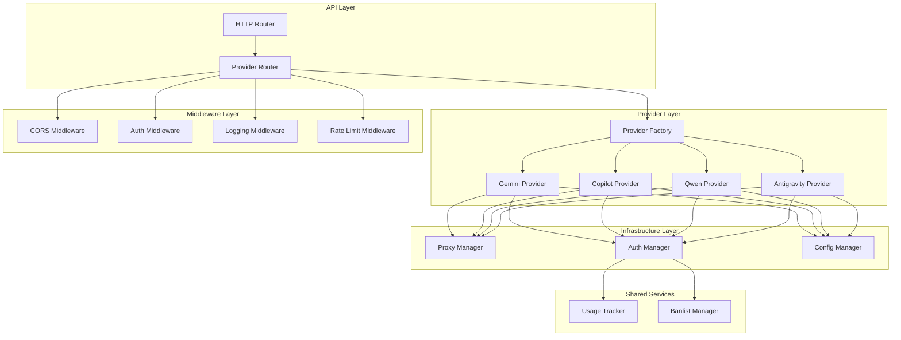

# Multi-Provider Refactoring Plan

This directory contains a comprehensive, step-by-step refactoring plan to transform the gcli2apigo codebase from a single-provider (Gemini-cli) system into a scalable, modular multi-provider platform.

## Overview

The refactoring follows these key principles:

1. **Strategy Pattern**: Each provider implements the same [`Provider`](01_core_interfaces.md:29) interface
2. **Factory Pattern**: [`ProviderFactory`](05_provider_factory.md:105) creates provider instances dynamically
3. **Interface-Driven Design**: All providers share common abstractions
4. **Zero Spaghetti Dependencies**: Clear separation of concerns with dependency injection
5. **Code Reuse**: Common functionality abstracted into shared services
6. **Extensibility**: Adding new providers requires minimal code changes

## Implementation Steps

Each step is a self-contained execution unit with specific context, objectives, file paths, and code snippets.

| Step | File | Description |
|-------|-------|-------------|
| 01 | [`01_core_interfaces.md`](01_core_interfaces.md:1) | Define core interfaces (Provider, Transformer, Proxy) |
| 02 | [`02_shared_models.md`](02_shared_models.md:1) | Define shared data structures |
| 03 | [`03_proxy_infrastructure.md`](03_proxy_infrastructure.md:1) | Implement HTTP proxy infrastructure |
| 04 | [`04_proxy_manager.md`](04_proxy_manager.md:1) | Implement proxy manager for multiple proxies |
| 05 | [`05_provider_factory.md`](05_provider_factory.md:1) | Implement provider factory pattern |
| 06 | [`06_configuration_management.md`](06_configuration_management.md:1) | Implement configuration management |
| 07 | [`07_shared_middleware.md`](07_shared_middleware.md:1) | Implement shared HTTP middleware |
| 08 | [`08_provider_router.md`](08_provider_router.md:1) | Implement provider routing mechanism |
| 09 | [`09_gemini_migration.md`](09_gemini_migration.md:1) | Migrate existing Gemini code |
| 10 | [`10_copilot_provider.md`](10_copilot_provider.md:1) | Implement Copilot provider |
| 11 | [`11_qwen_provider.md`](11_qwen_provider.md:1) | Implement Qwen provider |
| 12 | [`12_antigravity_provider.md`](12_antigravity_provider.md:1) | Implement Antigravity provider |
| 13 | [`13_main_integration.md`](13_main_integration.md:1) | Integrate everything in main.go |

## Architecture Diagram



## Provider Endpoints

| Provider | Base Path | Chat Completions | Models |
|----------|-----------|------------------|--------|
| Gemini (Default) | `/v1/` | `/v1/chat/completions` | `/v1/models` |
| Gemini (Native) | `/geminicli/` | `/geminicli/chat/completions` | `/geminicli/models` |
| Copilot | `/copilotcli/` | `/copilotcli/chat/completions` | `/copilotcli/models` |
| Qwen | `/qwencli/` | `/qwencli/chat/completions` | `/qwencli/models` |
| Antigravity | `/antigravitycli/` | `/antigravitycli/chat/completions` | `/antigravitycli/models` |

## Proxy Configuration

Each provider has distinct HTTP proxy configuration to prevent IP blocking:

| Provider | Environment Variables |
|----------|---------------------|
| Gemini | `GEMINI_PROXY_ENABLED`, `GEMINI_PROXY_HTTP`, `GEMINI_PROXY_HTTPS`, `GEMINI_PROXY_NO` |
| Copilot | `COPILOT_PROXY_ENABLED`, `COPILOT_PROXY_HTTP`, `COPILOT_PROXY_HTTPS`, `COPILOT_PROXY_NO` |
| Qwen | `QWEN_PROXY_ENABLED`, `QWEN_PROXY_HTTP`, `QWEN_PROXY_HTTPS`, `QWEN_PROXY_NO` |
| Antigravity | `ANTIGRAVITY_PROXY_ENABLED`, `ANTIGRAVITY_PROXY_HTTP`, `ANTIGRAVITY_PROXY_HTTPS`, `ANTIGRAVITY_PROXY_NO` |

## Directory Structure

```
gcli2apigo/
├── internal/
│   ├── providers/
│   │   ├── interfaces.go              # Core provider interface
│   │   ├── factory.go                # Provider factory
│   │   ├── registry.go               # Provider registry
│   │   ├── gemini/                  # Gemini provider
│   │   │   ├── provider.go
│   │   │   ├── client.go
│   │   │   └── transforme.go
│   │   ├── copilot/                 # Copilot provider
│   │   ├── qwen/                    # Qwen provider
│   │   └── antigravity/            # Antigravity provider
│   ├── proxy/
│   │   ├── interfaces.go              # Proxy interface
│   │   ├── manager.go                 # Proxy manager
│   │   ├── http_proxy.go             # HTTP proxy implementation
│   │   └── proxy_config.go           # Proxy configuration
│   ├── routes/
│   │   ├── middleware.go              # Shared middleware
│   │   └── provider_router.go         # Provider routing
│   ├── config/
│   │   └── provider_config.go         # Provider configuration
│   └── models/
│       ├── common.go                  # Common types
│       ├── request.go                 # Request models
│       └── response.go                # Response models
└── main.go                           # Application entry
```

## Key Features

### 1. Multi-Provider Support
- Support for Gemini, Copilot, Qwen, and Antigravity
- Easy addition of new providers
- Provider-specific configuration

### 2. OpenAI-Compatible API
- `/v1/chat/completions` endpoint
- `/v1/models` endpoint
- Consistent request/response format

### 3. Provider-Specific Endpoints
- `/geminicli/*` for Gemini
- `/copilotcli/*` for Copilot
- `/qwencli/*` for Qwen
- `/antigravitycli/*` for Antigravity

### 4. Proxy Support
- Distinct HTTP proxy per provider
- Proxy bypass rules (no_proxy)
- Health checks for proxies

### 5. Shared Middleware
- CORS handling
- Authentication
- Request logging
- Rate limiting
- Error handling

### 6. Dashboard Integration
- Existing dashboard functionality preserved
- Provider management
- Credential management

## Implementation Order

Follow the numbered steps in order:

1. Start with **Step 01**: Core Interfaces
2. Proceed sequentially through each step
3. Each step is self-contained and can be implemented independently
4. Complete all steps before integration (Step 13)

## Testing Strategy

1. Unit tests for each component
2. Integration tests for provider factory
3. End-to-end tests for routing
4. Load testing for proxy functionality
5. Compatibility tests with existing clients

## Migration Notes

### Backward Compatibility

- Existing `/v1/chat/completions` endpoint continues to work
- Existing `/v1/models` endpoint continues to work
- Existing Gemini routes are preserved
- Dashboard functionality is maintained

### Breaking Changes

- New provider-specific endpoints are added
- Configuration structure changes (new environment variables)
- Internal refactoring (no API changes)

## Getting Started

1. Review all step files in this directory
2. Start with Step 01 and proceed sequentially
3. Each step includes verification criteria
4. Test each step before proceeding to the next

## Support

For questions or issues during implementation:

1. Review the specific step file for detailed guidance
2. Each file includes complete code examples
3. Dependencies between steps are clearly documented
4. Verification steps ensure correct implementation

## Next Steps

After completing all 13 steps:

1. Run comprehensive tests
2. Update documentation
3. Deploy to staging environment
4. Monitor performance
5. Gather feedback and iterate
