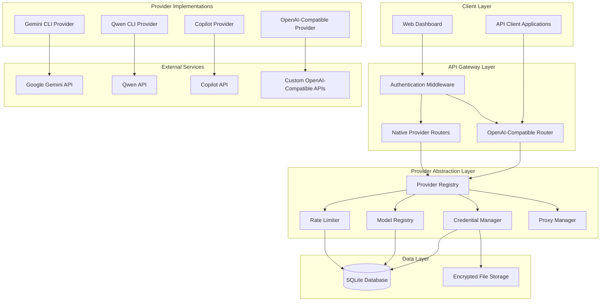
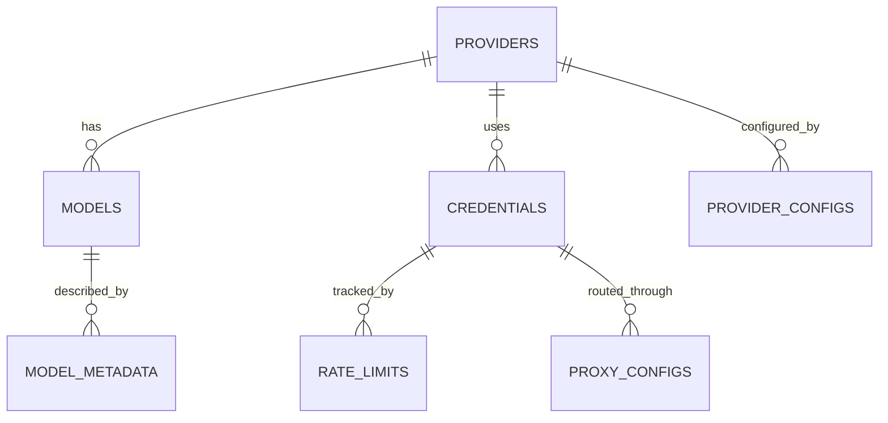
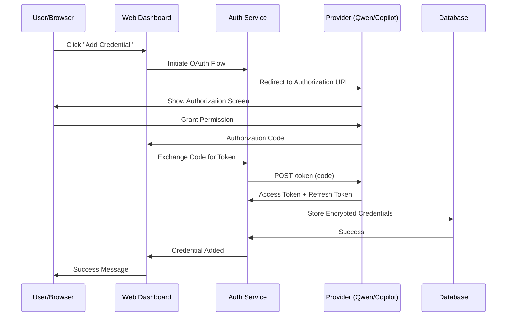
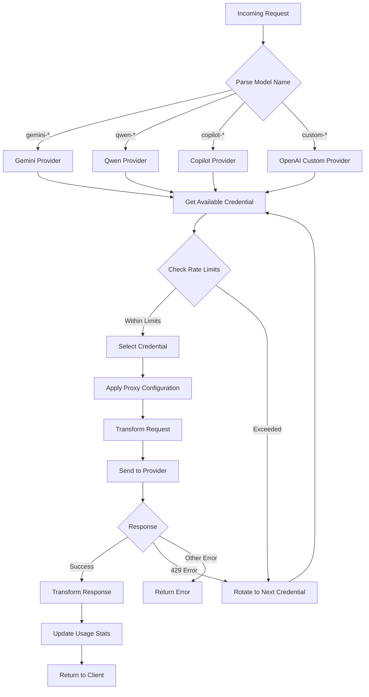
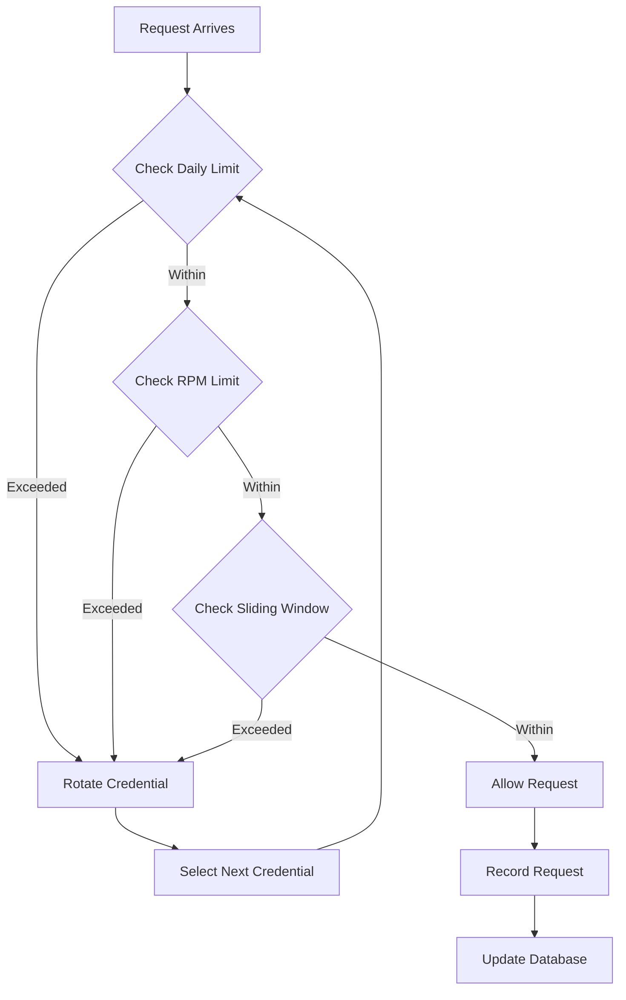

# Multi-Provider LLM Integration System - Technical Implementation Plan

## Executive Summary

This document provides a comprehensive technical implementation plan for extending the existing gcli2apigo system to support multiple LLM providers including unofficial CLI-based endpoints (Qwen CLI, Copilot) and official OpenAI-compatible APIs. The architecture maintains backward compatibility with the existing Gemini OAuth implementation while adding flexible configuration, secure credential storage, dynamic model registry, advanced rate limiting, and granular proxy support.

## Table of Contents

1. [System Architecture Overview](#system-architecture-overview)
2. [Database Schema Design](#database-schema-design)
3. [Authentication Flows](#authentication-flows)
4. [Provider Configuration System](#provider-configuration-system)
5. [Dynamic Model Registry](#dynamic-model-registry)
6. [Request Routing System](#request-routing-system)
7. [Rate Limiting & Credential Rotation](#rate-limiting--credential-rotation)
8. [Proxy Integration](#proxy-integration)
9. [Security Considerations](#security-considerations)
10. [Implementation Phases](#implementation-phases)

---

## System Architecture Overview

### High-Level Architecture



### Component Responsibilities

| Component | Responsibility |
|-----------|---------------|
| **Provider Registry** | Central registry of all available providers with their capabilities |
| **Model Registry** | Dynamic catalog of models per provider with metadata |
| **Credential Manager** | Secure storage and retrieval of credentials (OAuth tokens, API keys) |
| **Rate Limiter** | Per-credential rate limiting with automatic rotation |
| **Proxy Manager** | Per-credential proxy assignment and connection management |
| **Request Router** | Routes requests to appropriate provider based on model name |
| **Transformers** | Converts between OpenAI format and provider-specific formats |

---

## Database Schema Design

### Database Technology Choice

**SQLite** with encryption layer for sensitive data:
- Lightweight, no external dependencies
- ACID compliance for data integrity
- Easy backup and migration
- File-based for container compatibility
- Encryption using AES-256-GCM for sensitive fields

### Schema Overview



### Table Definitions

#### 1. PROVIDERS Table

Stores provider configurations and capabilities.

```sql
CREATE TABLE providers (
    id INTEGER PRIMARY KEY AUTOINCREMENT,
    provider_id TEXT UNIQUE NOT NULL,           -- e.g., 'gemini-cli', 'qwen-cli', 'copilot', 'openai-custom'
    provider_name TEXT NOT NULL,                -- e.g., 'Gemini CLI', 'Qwen CLI'
    provider_type TEXT NOT NULL,               -- 'oauth-cli', 'api-key', 'custom'
    auth_type TEXT NOT NULL,                  -- 'oauth2', 'api-key', 'bearer-token'
    is_active BOOLEAN DEFAULT 1,
    supports_streaming BOOLEAN DEFAULT 1,
    supports_function_calling BOOLEAN DEFAULT 0,
    supports_vision BOOLEAN DEFAULT 0,
    supports_reasoning BOOLEAN DEFAULT 0,
    base_url TEXT,                           -- For OpenAI-compatible providers
    default_headers TEXT,                      -- JSON array of default headers
    created_at TIMESTAMP DEFAULT CURRENT_TIMESTAMP,
    updated_at TIMESTAMP DEFAULT CURRENT_TIMESTAMP
);
```

**Indexes:**
- `idx_provider_id` on `provider_id`
- `idx_provider_type` on `provider_type`
- `idx_is_active` on `is_active`

#### 2. PROVIDER_CONFIGS Table

Flexible configuration for OpenAI-compatible providers.

```sql
CREATE TABLE provider_configs (
    id INTEGER PRIMARY KEY AUTOINCREMENT,
    provider_id TEXT NOT NULL,
    config_key TEXT NOT NULL,                 -- e.g., 'base_url', 'default_model', 'max_tokens'
    config_value TEXT NOT NULL,                -- JSON string for complex values
    value_type TEXT NOT NULL,                 -- 'string', 'number', 'boolean', 'json'
    is_encrypted BOOLEAN DEFAULT 0,
    created_at TIMESTAMP DEFAULT CURRENT_TIMESTAMP,
    updated_at TIMESTAMP DEFAULT CURRENT_TIMESTAMP,
    FOREIGN KEY (provider_id) REFERENCES providers(provider_id) ON DELETE CASCADE,
    UNIQUE(provider_id, config_key)
);
```

#### 3. CREDENTIALS Table

Secure storage of OAuth tokens and API keys.

```sql
CREATE TABLE credentials (
    id INTEGER PRIMARY KEY AUTOINCREMENT,
    provider_id TEXT NOT NULL,
    credential_name TEXT NOT NULL,              -- User-friendly name
    credential_type TEXT NOT NULL,             -- 'oauth2', 'api-key', 'bearer-token'
    
    -- OAuth2 fields
    access_token_encrypted TEXT,               -- AES-256-GCM encrypted
    refresh_token_encrypted TEXT,              -- AES-256-GCM encrypted
    token_expiry TIMESTAMP,
    client_id TEXT,
    client_secret_encrypted TEXT,              -- AES-256-GCM encrypted
    token_url TEXT,
    scopes TEXT,                             -- JSON array
    
    -- API Key fields
    api_key_encrypted TEXT,                   -- AES-256-GCM encrypted
    
    -- Metadata
    project_id TEXT,                          -- For Gemini: GCP project ID
    user_email TEXT,
    is_active BOOLEAN DEFAULT 1,
    is_banned BOOLEAN DEFAULT 0,
    ban_reason TEXT,
    
    -- Usage tracking
    total_requests INTEGER DEFAULT 0,
    successful_requests INTEGER DEFAULT 0,
    failed_requests INTEGER DEFAULT 0,
    last_used_at TIMESTAMP,
    last_error_code INTEGER,
    last_error_message TEXT,
    
    created_at TIMESTAMP DEFAULT CURRENT_TIMESTAMP,
    updated_at TIMESTAMP DEFAULT CURRENT_TIMESTAMP,
    
    FOREIGN KEY (provider_id) REFERENCES providers(provider_id) ON DELETE CASCADE
);
```

**Indexes:**
- `idx_provider_id` on `provider_id`
- `idx_credential_type` on `credential_type`
- `idx_is_active` on `is_active`
- `idx_is_banned` on `is_banned`
- `idx_last_used_at` on `last_used_at`

#### 4. RATE_LIMITS Table

Per-credential rate limit configuration and tracking.

```sql
CREATE TABLE rate_limits (
    id INTEGER PRIMARY KEY AUTOINCREMENT,
    credential_id INTEGER NOT NULL,
    
    -- Configuration
    requests_per_minute INTEGER DEFAULT 60,
    requests_per_day INTEGER DEFAULT 1000,
    tokens_per_minute INTEGER,
    tokens_per_day INTEGER,
    
    -- Current state (reset daily)
    requests_today INTEGER DEFAULT 0,
    tokens_today INTEGER DEFAULT 0,
    last_reset_date DATE,
    
    -- Sliding window tracking (reset hourly)
    request_timestamps TEXT,                  -- JSON array of timestamps for sliding window
    
    created_at TIMESTAMP DEFAULT CURRENT_TIMESTAMP,
    updated_at TIMESTAMP DEFAULT CURRENT_TIMESTAMP,
    
    FOREIGN KEY (credential_id) REFERENCES credentials(id) ON DELETE CASCADE
);
```

#### 5. PROXY_CONFIGS Table

Proxy configuration per credential.

```sql
CREATE TABLE proxy_configs (
    id INTEGER PRIMARY KEY AUTOINCREMENT,
    credential_id INTEGER UNIQUE NOT NULL,
    
    proxy_type TEXT NOT NULL,                  -- 'https', 'socks5', 'none'
    proxy_host TEXT,
    proxy_port INTEGER,
    proxy_username_encrypted TEXT,              -- AES-256-GCM encrypted
    proxy_password_encrypted TEXT,              -- AES-256-GCM encrypted
    
    -- Connection settings
    connect_timeout_seconds INTEGER DEFAULT 30,
    read_timeout_seconds INTEGER DEFAULT 60,
    max_idle_connections INTEGER DEFAULT 100,
    idle_connection_timeout_seconds INTEGER DEFAULT 90,
    
    -- Health check
    is_healthy BOOLEAN DEFAULT 1,
    last_health_check TIMESTAMP,
    health_check_failures INTEGER DEFAULT 0,
    
    created_at TIMESTAMP DEFAULT CURRENT_TIMESTAMP,
    updated_at TIMESTAMP DEFAULT CURRENT_TIMESTAMP,
    
    FOREIGN KEY (credential_id) REFERENCES credentials(id) ON DELETE CASCADE
);
```

#### 6. MODELS Table

Dynamic model registry with metadata.

```sql
CREATE TABLE models (
    id INTEGER PRIMARY KEY AUTOINCREMENT,
    provider_id TEXT NOT NULL,
    model_id TEXT NOT NULL,                   -- e.g., 'gemini-2.5-pro', 'qwen-max'
    model_name TEXT NOT NULL,                 -- Display name
    model_version TEXT,
    
    -- Capabilities
    max_input_tokens INTEGER,
    max_output_tokens INTEGER,
    supports_streaming BOOLEAN DEFAULT 1,
    supports_function_calling BOOLEAN DEFAULT 0,
    supports_vision BOOLEAN DEFAULT 0,
    supports_reasoning BOOLEAN DEFAULT 0,
    supports_json_mode BOOLEAN DEFAULT 0,
    
    -- Pricing (optional, for cost tracking)
    input_cost_per_1k_tokens REAL,
    output_cost_per_1k_tokens REAL,
    
    -- Rate limit tiers
    rate_limit_tier TEXT,                    -- 'free', 'pro', 'enterprise'
    
    is_active BOOLEAN DEFAULT 1,
    created_at TIMESTAMP DEFAULT CURRENT_TIMESTAMP,
    updated_at TIMESTAMP DEFAULT CURRENT_TIMESTAMP,
    
    FOREIGN KEY (provider_id) REFERENCES providers(provider_id) ON DELETE CASCADE,
    UNIQUE(provider_id, model_id)
);
```

**Indexes:**
- `idx_provider_id` on `provider_id`
- `idx_model_id` on `model_id`
- `idx_is_active` on `is_active`
- `idx_rate_limit_tier` on `rate_limit_tier`

#### 7. MODEL_METADATA Table

Extended metadata for models.

```sql
CREATE TABLE model_metadata (
    id INTEGER PRIMARY KEY AUTOINCREMENT,
    model_id INTEGER NOT NULL,
    metadata_key TEXT NOT NULL,
    metadata_value TEXT NOT NULL,
    value_type TEXT NOT NULL,                 -- 'string', 'number', 'boolean', 'json'
    created_at TIMESTAMP DEFAULT CURRENT_TIMESTAMP,
    
    FOREIGN KEY (model_id) REFERENCES models(id) ON DELETE CASCADE,
    UNIQUE(model_id, metadata_key)
);
```

#### 8. REQUEST_LOG Table (Optional - for debugging)

```sql
CREATE TABLE request_log (
    id INTEGER PRIMARY KEY AUTOINCREMENT,
    credential_id INTEGER,
    model_id TEXT,
    request_type TEXT,                        -- 'chat', 'completion', 'embedding'
    
    -- Request details
    input_tokens INTEGER,
    output_tokens INTEGER,
    latency_ms INTEGER,
    status_code INTEGER,
    error_message TEXT,
    
    timestamp TIMESTAMP DEFAULT CURRENT_TIMESTAMP,
    
    FOREIGN KEY (credential_id) REFERENCES credentials(id) ON DELETE SET NULL
);
```

### Database Initialization Script

```sql
-- Insert default providers
INSERT INTO providers (provider_id, provider_name, provider_type, auth_type, 
                     supports_streaming, supports_function_calling, supports_vision, supports_reasoning) 
VALUES 
('gemini-cli', 'Gemini CLI', 'oauth-cli', 'oauth2', 1, 1, 1, 1),
('qwen-cli', 'Qwen CLI', 'oauth-cli', 'oauth2', 1, 1, 1, 0),
('copilot', 'GitHub Copilot', 'oauth-cli', 'oauth2', 1, 1, 0, 0),
('openai-custom', 'OpenAI Custom', 'api-key', 'api-key', 1, 1, 1, 1);

-- Insert default Gemini models
INSERT INTO models (provider_id, model_id, model_name, max_input_tokens, max_output_tokens,
                  supports_streaming, supports_function_calling, supports_vision, supports_reasoning,
                  rate_limit_tier)
VALUES
('gemini-cli', 'gemini-2.5-pro', 'Gemini 2.5 Pro', 1048576, 65535, 1, 1, 1, 1, 'pro'),
('gemini-cli', 'gemini-2.5-flash', 'Gemini 2.5 Flash', 1048576, 65535, 1, 1, 1, 0, 'free');

-- Insert default Qwen models (example)
INSERT INTO models (provider_id, model_id, model_name, max_input_tokens, max_output_tokens,
                  supports_streaming, supports_function_calling, supports_vision, supports_reasoning,
                  rate_limit_tier)
VALUES
('qwen-cli', 'qwen-max', 'Qwen Max', 32768, 8192, 1, 1, 1, 0, 'pro'),
('qwen-cli', 'qwen-plus', 'Qwen Plus', 32768, 8192, 1, 1, 1, 0, 'free');

-- Insert default Copilot models (example)
INSERT INTO models (provider_id, model_id, model_name, max_input_tokens, max_output_tokens,
                  supports_streaming, supports_function_calling, supports_vision, supports_reasoning,
                  rate_limit_tier)
VALUES
('copilot', 'gpt-4-copilot', 'GPT-4 Copilot', 8192, 4096, 1, 1, 0, 0, 'pro'),
('copilot', 'gpt-3.5-copilot', 'GPT-3.5 Copilot', 4096, 2048, 1, 1, 0, 0, 'free');
```

---

## Authentication Flows

### OAuth2 Flow for CLI-based Providers



### OAuth2 Flow Implementation

#### 1. Provider-Specific OAuth Configuration

```go
// internal/providers/oauth_config.go

type OAuthProviderConfig struct {
    ProviderID      string
    AuthURL        string
    TokenURL       string
    ClientID       string
    ClientSecret   string
    Scopes         []string
    RedirectURL    string
}

var OAuthProviderConfigs = map[string]OAuthProviderConfig{
    "gemini-cli": {
        ProviderID:    "gemini-cli",
        AuthURL:      "https://accounts.google.com/o/oauth2/v2/auth",
        TokenURL:     "https://oauth2.googleapis.com/token",
        ClientID:     "681255809395-oo8ft2oprdrnp9e3aqf6av3hmdib135j.apps.googleusercontent.com",
        ClientSecret: "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",
        Scopes: []string{
            "https://www.googleapis.com/auth/cloud-platform",
            "https://www.googleapis.com/auth/userinfo.email",
        },
    },
    "qwen-cli": {
        ProviderID:    "qwen-cli",
        AuthURL:      "https://oauth.aliyun.com/oauth2/authorize",
        TokenURL:     "https://oauth.aliyun.com/oauth2/token",
        ClientID:     os.Getenv("QWEN_CLIENT_ID"),
        ClientSecret: os.Getenv("QWEN_CLIENT_SECRET"),
        Scopes: []string{
            "openid",
            "profile",
            "https://www.aliyun.com/product/alicloudqwen",
        },
    },
    "copilot": {
        ProviderID:    "copilot",
        AuthURL:      "https://github.com/login/oauth/authorize",
        TokenURL:     "https://github.com/login/oauth/access_token",
        ClientID:     os.Getenv("COPILOT_CLIENT_ID"),
        ClientSecret: os.Getenv("COPILOT_CLIENT_SECRET"),
        Scopes: []string{
            "read:user",
            "read:org",
            "copilot",
        },
    },
}
```

#### 2. Token Exchange and Storage

```go
// internal/providers/oauth_manager.go

type OAuthToken struct {
    AccessToken  string
    RefreshToken string
    TokenType   string
    ExpiresIn   int
    Scope       string
    ProjectID   string // Provider-specific identifier
}

func ExchangeCodeForToken(providerID, code string) (*OAuthToken, error) {
    config, exists := OAuthProviderConfigs[providerID]
    if !exists {
        return nil, fmt.Errorf("unknown provider: %s", providerID)
    }

    // Exchange code for token
    resp, err := http.PostForm(config.TokenURL, url.Values{
        "client_id":     {config.ClientID},
        "client_secret": {config.ClientSecret},
        "code":          {code},
        "grant_type":    {"authorization_code"},
        "redirect_uri":   {config.RedirectURL},
    })
    if err != nil {
        return nil, err
    }
    defer resp.Body.Close()

    var token OAuthToken
    if err := json.NewDecoder(resp.Body).Decode(&token); err != nil {
        return nil, err
    }

    // Store encrypted in database
    if err := StoreEncryptedCredential(providerID, &token); err != nil {
        return nil, err
    }

    return &token, nil
}

func RefreshToken(providerID, refreshToken string) (*OAuthToken, error) {
    config := OAuthProviderConfigs[providerID]
    
    resp, err := http.PostForm(config.TokenURL, url.Values{
        "client_id":     {config.ClientID},
        "client_secret": {config.ClientSecret},
        "refresh_token": {refreshToken},
        "grant_type":    {"refresh_token"},
    })
    // ... handle response and update database
}
```

#### 3. Token Encryption

```go
// internal/crypto/encryption.go

import (
    "crypto/aes"
    "crypto/cipher"
    "crypto/rand"
    "encoding/base64"
    "io"
)

type Encryptor struct {
    key []byte
}

func NewEncryptor(key string) *Encryptor {
    // Derive 32-byte key from passphrase
    hash := sha256.Sum256([]byte(key))
    return &Encryptor{key: hash[:]}
}

func (e *Encryptor) Encrypt(plaintext string) (string, error) {
    block, err := aes.NewCipher(e.key)
    if err != nil {
        return "", err
    }

    gcm, err := cipher.NewGCM(block)
    if err != nil {
        return "", err
    }

    nonce := make([]byte, gcm.NonceSize())
    if _, err := io.ReadFull(rand.Reader, nonce); err != nil {
        return "", err
    }

    ciphertext := gcm.Seal(nonce, nonce, []byte(plaintext), nil)
    return base64.StdEncoding.EncodeToString(ciphertext), nil
}

func (e *Encryptor) Decrypt(ciphertext string) (string, error) {
    data, err := base64.StdEncoding.DecodeString(ciphertext)
    if err != nil {
        return "", err
    }

    block, err := aes.NewCipher(e.key)
    if err != nil {
        return "", err
    }

    gcm, err := cipher.NewGCM(block)
    if err != nil {
        return "", err
    }

    nonceSize := gcm.NonceSize()
    if len(data) < nonceSize {
        return "", fmt.Errorf("ciphertext too short")
    }

    nonce, ciphertext := data[:nonceSize], data[nonceSize:]
    plaintext, err := gcm.Open(nil, nonce, ciphertext, nil)
    if err != nil {
        return "", err
    }

    return string(plaintext), nil
}
```

### API Key Authentication

```go
// internal/providers/api_key_manager.go

type APIKeyCredential struct {
    ProviderID   string
    APIKey       string
    CredentialName string
}

func StoreAPIKeyCredential(cred *APIKeyCredential) error {
    encryptor := NewEncryptor(os.Getenv("ENCRYPTION_KEY"))
    encryptedKey, err := encryptor.Encrypt(cred.APIKey)
    if err != nil {
        return err
    }

    query := `
        INSERT INTO credentials (provider_id, credential_name, credential_type, 
                             api_key_encrypted, is_active)
        VALUES (?, ?, ?, ?, 1)
    `
    _, err = db.Exec(query, cred.ProviderID, cred.CredentialName, "api-key", encryptedKey)
    return err
}

func GetAPIKeyCredential(credentialID int) (*APIKeyCredential, error) {
    // Query database and decrypt
}
```

---

## Provider Configuration System

### Configuration Structure

```go
// internal/providers/config.go

type ProviderConfig struct {
    ProviderID     string
    ProviderName   string
    ProviderType   string // 'oauth-cli', 'api-key', 'custom'
    AuthType      string // 'oauth2', 'api-key', 'bearer-token'
    
    // OpenAI-compatible provider settings
    BaseURL        string
    DefaultHeaders map[string]string
    Models         []ModelConfig
    
    // OAuth settings
    OAuthConfig    *OAuthProviderConfig
    
    // Capabilities
    SupportsStreaming       bool
    SupportsFunctionCalling bool
    SupportsVision        bool
    SupportsReasoning     bool
}

type ModelConfig struct {
    ModelID              string
    ModelName            string
    MaxInputTokens       int
    MaxOutputTokens      int
    SupportsStreaming     bool
    SupportsFunctionCalling bool
    SupportsVision        bool
    SupportsReasoning     bool
    SupportsJSONMode      bool
    RateLimitTier        string
}

// Load provider configurations from database
func LoadProviderConfigs(db *sql.DB) (map[string]*ProviderConfig, error) {
    configs := make(map[string]*ProviderConfig)
    
    rows, err := db.Query(`
        SELECT provider_id, provider_name, provider_type, auth_type,
               base_url, default_headers, supports_streaming,
               supports_function_calling, supports_vision, supports_reasoning
        FROM providers WHERE is_active = 1
    `)
    if err != nil {
        return nil, err
    }
    defer rows.Close()
    
    for rows.Next() {
        var config ProviderConfig
        var headersJSON string
        // Scan row into config struct
        // Parse headersJSON into DefaultHeaders map
        configs[config.ProviderID] = &config
    }
    
    return configs, nil
}
```

### Dynamic Provider Registration

```go
// internal/providers/registry.go

type ProviderRegistry struct {
    providers map[string]*ProviderConfig
    mu        sync.RWMutex
}

func NewProviderRegistry() *ProviderRegistry {
    return &ProviderRegistry{
        providers: make(map[string]*ProviderConfig),
    }
}

func (pr *ProviderRegistry) RegisterProvider(config *ProviderConfig) error {
    pr.mu.Lock()
    defer pr.mu.Unlock()
    
    if _, exists := pr.providers[config.ProviderID]; exists {
        return fmt.Errorf("provider already registered: %s", config.ProviderID)
    }
    
    pr.providers[config.ProviderID] = config
    return nil
}

func (pr *ProviderRegistry) GetProvider(providerID string) (*ProviderConfig, error) {
    pr.mu.RLock()
    defer pr.mu.RUnlock()
    
    provider, exists := pr.providers[providerID]
    if !exists {
        return nil, fmt.Errorf("provider not found: %s", providerID)
    }
    
    return provider, nil
}

func (pr *ProviderRegistry) ListProviders() []*ProviderConfig {
    pr.mu.RLock()
    defer pr.mu.RUnlock()
    
    providers := make([]*ProviderConfig, 0, len(pr.providers))
    for _, p := range pr.providers {
        providers = append(providers, p)
    }
    
    return providers
}
```

---

## Dynamic Model Registry

### Model Registry Implementation

```go
// internal/models/registry.go

type ModelRegistry struct {
    models map[string]*ModelInfo // Key: provider_id:model_id
    mu     sync.RWMutex
}

type ModelInfo struct {
    ProviderID           string
    ModelID              string
    ModelName            string
    MaxInputTokens       int
    MaxOutputTokens      int
    SupportsStreaming     bool
    SupportsFunctionCalling bool
    SupportsVision        bool
    SupportsReasoning     bool
    SupportsJSONMode      bool
    RateLimitTier        string
    InputCostPer1K      float64
    OutputCostPer1K     float64
}

func NewModelRegistry() *ModelRegistry {
    return &ModelRegistry{
        models: make(map[string]*ModelInfo),
    }
}

func (mr *ModelRegistry) LoadFromDatabase(db *sql.DB) error {
    mr.mu.Lock()
    defer mr.mu.Unlock()
    
    rows, err := db.Query(`
        SELECT provider_id, model_id, model_name, max_input_tokens, max_output_tokens,
               supports_streaming, supports_function_calling, supports_vision,
               supports_reasoning, supports_json_mode, rate_limit_tier,
               input_cost_per_1k_tokens, output_cost_per_1k_tokens
        FROM models WHERE is_active = 1
    `)
    if err != nil {
        return err
    }
    defer rows.Close()
    
    for rows.Next() {
        var model ModelInfo
        // Scan row into model struct
        key := fmt.Sprintf("%s:%s", model.ProviderID, model.ModelID)
        mr.models[key] = &model
    }
    
    return nil
}

func (mr *ModelRegistry) GetModel(providerID, modelID string) (*ModelInfo, error) {
    mr.mu.RLock()
    defer mr.mu.RUnlock()
    
    key := fmt.Sprintf("%s:%s", providerID, modelID)
    model, exists := mr.models[key]
    if !exists {
        return nil, fmt.Errorf("model not found: %s", key)
    }
    
    return model, nil
}

func (mr *ModelRegistry) ListModelsByProvider(providerID string) []*ModelInfo {
    mr.mu.RLock()
    defer mr.mu.RUnlock()
    
    models := make([]*ModelInfo, 0)
    prefix := providerID + ":"
    
    for key, model := range mr.models {
        if strings.HasPrefix(key, prefix) {
            models = append(models, model)
        }
    }
    
    return models
}

func (mr *ModelRegistry) ListAllModels() []*ModelInfo {
    mr.mu.RLock()
    defer mr.mu.RUnlock()
    
    models := make([]*ModelInfo, 0, len(mr.models))
    for _, model := range mr.models {
        models = append(models, model)
    }
    
    return models
}
```

### Model Discovery API

```go
// internal/api/models.go

func HandleListModels(w http.ResponseWriter, r *http.Request) {
    registry := GetModelRegistry()
    allModels := registry.ListAllModels()
    
    // Convert to OpenAI format
    openaiModels := make([]map[string]interface{}, 0)
    
    for _, model := range allModels {
        openaiModel := map[string]interface{}{
            "id":       model.ModelID,
            "object":   "model",
            "created":   time.Now().Unix(),
            "owned_by": model.ProviderID,
            "permission": []map[string]interface{}{
                {
                    "id":                   "modelperm-" + strings.ReplaceAll(model.ModelID, "/", "-"),
                    "object":               "model_permission",
                    "created":              time.Now().Unix(),
                    "allow_create_engine":  false,
                    "allow_sampling":       true,
                    "allow_logprobs":       false,
                    "allow_search_indices": false,
                    "allow_view":           true,
                    "allow_fine_tuning":    false,
                    "organization":         "*",
                    "group":                nil,
                    "is_blocking":          false,
                },
            },
            "root":   model.ModelID,
            "parent": nil,
        }
        openaiModels = append(openaiModels, openaiModel)
    }
    
    response := map[string]interface{}{
        "object": "list",
        "data":   openaiModels,
    }
    
    w.Header().Set("Content-Type", "application/json")
    json.NewEncoder(w).Encode(response)
}
```

---

## Request Routing System

### Request Flow



### Router Implementation

```go
// internal/routes/router.go

type RequestRouter struct {
    providerRegistry *ProviderRegistry
    modelRegistry   *ModelRegistry
    credentialMgr  *CredentialManager
    rateLimiter     *RateLimiter
    proxyManager    *ProxyManager
}

func NewRequestRouter(
    pr *ProviderRegistry,
    mr *ModelRegistry,
    cm *CredentialManager,
    rl *RateLimiter,
    pm *ProxyManager,
) *RequestRouter {
    return &RequestRouter{
        providerRegistry: pr,
        modelRegistry:   mr,
        credentialMgr:  cm,
        rateLimiter:    rl,
        proxyManager:    pm,
    }
}

func (rr *RequestRouter) RouteRequest(modelID string) (*ProviderConfig, *Credential, error) {
    // Determine provider from model ID
    providerID, err := rr.extractProviderID(modelID)
    if err != nil {
        return nil, nil, err
    }
    
    // Get provider configuration
    provider, err := rr.providerRegistry.GetProvider(providerID)
    if err != nil {
        return nil, nil, err
    }
    
    // Get available credential for provider
    credential, err := rr.credentialMgr.GetAvailableCredential(providerID)
    if err != nil {
        return nil, nil, err
    }
    
    // Check rate limits
    if !rr.rateLimiter.CanMakeRequest(credential.ID) {
        // Try next credential
        credential, err = rr.credentialMgr.GetNextAvailableCredential(providerID, credential.ID)
        if err != nil {
            return nil, nil, fmt.Errorf("no available credentials within rate limits")
        }
    }
    
    return provider, credential, nil
}

func (rr *RequestRouter) extractProviderID(modelID string) (string, error) {
    // Parse model ID to determine provider
    if strings.HasPrefix(modelID, "gemini-") {
        return "gemini-cli", nil
    } else if strings.HasPrefix(modelID, "qwen-") {
        return "qwen-cli", nil
    } else if strings.HasPrefix(modelID, "copilot-") {
        return "copilot", nil
    } else if strings.HasPrefix(modelID, "gpt-") {
        return "openai-custom", nil
    } else {
        // Check database for custom model mappings
        return rr.lookupProviderForModel(modelID)
    }
}
```

### Request Transformation

```go
// internal/transformers/provider_transformer.go

type ProviderTransformer interface {
    TransformOpenAIRequest(openaiReq *models.OpenAIChatCompletionRequest) (interface{}, error)
    TransformProviderResponse(providerResp interface{}, modelID string) (interface{}, error)
}

type GeminiTransformer struct{}
type QwenTransformer struct{}
type CopilotTransformer struct{}
type OpenAICustomTransformer struct{}

func (gt *GeminiTransformer) TransformOpenAIRequest(openaiReq *models.OpenAIChatCompletionRequest) (interface{}, error) {
    // Existing transformation logic from transformers.go
    return transformers.OpenAIRequestToGemini(openaiReq), nil
}

func (qt *QwenTransformer) TransformOpenAIRequest(openaiReq *models.OpenAIChatCompletionRequest) (interface{}, error) {
    // Transform OpenAI format to Qwen format
    qwenReq := map[string]interface{}{
        "model":    openaiReq.Model,
        "messages": openaiReq.Messages,
        "stream":   openaiReq.Stream,
    }
    
    if openaiReq.Temperature != nil {
        qwenReq["temperature"] = *openaiReq.Temperature
    }
    if openaiReq.MaxTokens != nil {
        qwenReq["max_tokens"] = *openaiReq.MaxTokens
    }
    
    return qwenReq, nil
}

func (oct *OpenAICustomTransformer) TransformOpenAIRequest(openaiReq *models.OpenAIChatCompletionRequest) (interface{}, error) {
    // Pass through for OpenAI-compatible providers
    return openaiReq, nil
}
```

---

## Rate Limiting & Credential Rotation

### Rate Limiting Algorithm



### Rate Limiter Implementation

```go
// internal/rate/limiter.go

type RateLimiter struct {
    db  *sql.DB
    mu  sync.RWMutex
    cache map[int]*RateLimitState // credential_id -> state
}

type RateLimitState struct {
    CredentialID      int
    RequestsToday      int
    TokensToday       int
    RequestTimestamps  []time.Time // Sliding window (last 60 seconds)
    LastResetDate     time.Time
    mu                sync.Mutex
}

func NewRateLimiter(db *sql.DB) *RateLimiter {
    return &RateLimiter{
        db:    db,
        cache:  make(map[int]*RateLimitState),
    }
}

func (rl *RateLimiter) CanMakeRequest(credentialID int) bool {
    state := rl.getState(credentialID)
    state.mu.Lock()
    defer state.mu.Unlock()
    
    // Check daily reset
    now := time.Now()
    if now.Day() != state.LastResetDate.Day() {
        state.RequestsToday = 0
        state.TokensToday = 0
        state.LastResetDate = now
    }
    
    // Get limits from database
    limits := rl.getLimits(credentialID)
    
    // Check daily limits
    if state.RequestsToday >= limits.RequestsPerDay {
        return false
    }
    
    // Check RPM (sliding window)
    rl.cleanOldTimestamps(state, 60*time.Second)
    rpm := len(state.RequestTimestamps)
    if rpm >= limits.RequestsPerMinute {
        return false
    }
    
    return true
}

func (rl *RateLimiter) RecordRequest(credentialID int, inputTokens, outputTokens int) error {
    state := rl.getState(credentialID)
    state.mu.Lock()
    defer state.mu.Unlock()
    
    // Update counters
    state.RequestsToday++
    state.TokensToday += (inputTokens + outputTokens)
    state.RequestTimestamps = append(state.RequestTimestamps, time.Now())
    
    // Update database
    _, err := rl.db.Exec(`
        UPDATE rate_limits 
        SET requests_today = ?, tokens_today = ?, request_timestamps = ?, last_reset_date = ?
        WHERE credential_id = ?
    `, state.RequestsToday, state.TokensToday, 
       timestampsToJSON(state.RequestTimestamps), state.LastResetDate, credentialID)
    
    return err
}

func (rl *RateLimiter) cleanOldTimestamps(state *RateLimitState, window time.Duration) {
    now := time.Now()
    validTimestamps := make([]time.Time, 0)
    
    for _, ts := range state.RequestTimestamps {
        if now.Sub(ts) < window {
            validTimestamps = append(validTimestamps, ts)
        }
    }
    
    state.RequestTimestamps = validTimestamps
}

func (rl *RateLimiter) getState(credentialID int) *RateLimitState {
    rl.mu.RLock()
    state, exists := rl.cache[credentialID]
    rl.mu.RUnlock()
    
    if !exists {
        rl.mu.Lock()
        state = rl.loadStateFromDB(credentialID)
        rl.cache[credentialID] = state
        rl.mu.Unlock()
    }
    
    return state
}
```

### Credential Rotation Strategy

```go
// internal/auth/credential_rotation.go

type CredentialRotationManager struct {
    credentialMgr *CredentialManager
    rateLimiter   *RateLimiter
    currentIndex   map[string]int // provider_id -> current index
    mu            sync.RWMutex
}

func (crm *CredentialRotationManager) GetAvailableCredential(providerID string) (*Credential, error) {
    crm.mu.Lock()
    defer crm.mu.Unlock()
    
    // Get all active, unbanned credentials for provider
    credentials, err := crm.credentialMgr.GetActiveCredentials(providerID)
    if err != nil {
        return nil, err
    }
    
    if len(credentials) == 0 {
        return nil, fmt.Errorf("no active credentials for provider: %s", providerID)
    }
    
    // Round-robin selection with rate limit check
    maxAttempts := len(credentials) * 2
    for attempt := 0; attempt < maxAttempts; attempt++ {
        idx := crm.currentIndex[providerID] % len(credentials)
        cred := credentials[idx]
        crm.currentIndex[providerID]++
        
        if crm.rateLimiter.CanMakeRequest(cred.ID) {
            return cred, nil
        }
    }
    
    return nil, fmt.Errorf("all credentials for provider %s are rate-limited", providerID)
}

func (crm *CredentialRotationManager) HandleRateLimitError(credentialID int) (*Credential, error) {
    // Mark credential as temporarily rate-limited
    // Return next available credential
    providerID := crm.credentialMgr.GetProviderID(credentialID)
    return crm.GetAvailableCredential(providerID)
}
```

---

## Proxy Integration

### Proxy Configuration

```go
// internal/proxy/config.go

type ProxyConfig struct {
    Type                       string // 'https', 'socks5', 'none'
    Host                       string
    Port                       int
    Username                   string
    Password                   string
    ConnectTimeoutSeconds       int
    ReadTimeoutSeconds         int
    MaxIdleConnections        int
    IdleConnectionTimeoutSeconds int
    IsHealthy                 bool
    LastHealthCheck          time.Time
    HealthCheckFailures       int
}

type ProxyManager struct {
    db     *sql.DB
    cache  map[int]*ProxyConfig // credential_id -> config
    mu     sync.RWMutex
}

func NewProxyManager(db *sql.DB) *ProxyManager {
    return &ProxyManager{
        db:    db,
        cache:  make(map[int]*ProxyConfig),
    }
}

func (pm *ProxyManager) GetProxyConfig(credentialID int) (*ProxyConfig, error) {
    pm.mu.RLock()
    config, exists := pm.cache[credentialID]
    pm.mu.RUnlock()
    
    if !exists {
        config, err := pm.loadFromDB(credentialID)
        if err != nil {
            return nil, err
        }
        pm.mu.Lock()
        pm.cache[credentialID] = config
        pm.mu.Unlock()
    }
    
    return config, nil
}

func (pm *ProxyManager) CreateHTTPClient(credentialID int) (*http.Client, error) {
    config, err := pm.GetProxyConfig(credentialID)
    if err != nil {
        return nil, err
    }
    
    if config.Type == "none" {
        // Return default client
        return &http.Client{
            Timeout: time.Duration(config.ReadTimeoutSeconds) * time.Second,
        }, nil
    }
    
    // Create proxy URL
    var proxyURL string
    if config.Username != "" {
        proxyURL = fmt.Sprintf("%s://%s:%s@%s:%d",
            config.Type, config.Username, config.Password, config.Host, config.Port)
    } else {
        proxyURL = fmt.Sprintf("%s://%s:%d", config.Type, config.Host, config.Port)
    }
    
    proxy, err := url.Parse(proxyURL)
    if err != nil {
        return nil, err
    }
    
    transport := &http.Transport{
        Proxy: http.ProxyURL(proxy),
        DialContext: (&net.Dialer{
            Timeout:   time.Duration(config.ConnectTimeoutSeconds) * time.Second,
            KeepAlive: 30 * time.Second,
        }).DialContext,
        MaxIdleConns:          config.MaxIdleConnections,
        IdleConnTimeout:       time.Duration(config.IdleConnectionTimeoutSeconds) * time.Second,
        TLSHandshakeTimeout:   10 * time.Second,
        ResponseHeaderTimeout: time.Duration(config.ReadTimeoutSeconds) * time.Second,
    }
    
    return &http.Client{
        Transport: transport,
        Timeout:   time.Duration(config.ReadTimeoutSeconds) * time.Second,
    }, nil
}
```

### Proxy Health Check

```go
// internal/proxy/health.go

func (pm *ProxyManager) CheckProxyHealth(credentialID int) error {
    config, err := pm.GetProxyConfig(credentialID)
    if err != nil {
        return err
    }
    
    if config.Type == "none" {
        return nil
    }
    
    // Perform health check
    client, err := pm.CreateHTTPClient(credentialID)
    if err != nil {
        return err
    }
    defer client.CloseIdleConnections()
    
    // Test connectivity to a reliable endpoint
    ctx, cancel := context.WithTimeout(context.Background(), 10*time.Second)
    defer cancel()
    
    req, err := http.NewRequestWithContext(ctx, "GET", "https://www.google.com", nil)
    if err != nil {
        return err
    }
    
    resp, err := client.Do(req)
    if err != nil {
        pm.markUnhealthy(credentialID)
        return err
    }
    defer resp.Body.Close()
    
    if resp.StatusCode >= 200 && resp.StatusCode < 400 {
        pm.markHealthy(credentialID)
        return nil
    }
    
    pm.markUnhealthy(credentialID)
    return fmt.Errorf("proxy returned status code: %d", resp.StatusCode)
}

func (pm *ProxyManager) markHealthy(credentialID int) {
    pm.mu.Lock()
    defer pm.mu.Unlock()
    
    if config, exists := pm.cache[credentialID]; exists {
        config.IsHealthy = true
        config.LastHealthCheck = time.Now()
        config.HealthCheckFailures = 0
    }
    
    pm.db.Exec(`
        UPDATE proxy_configs 
        SET is_healthy = 1, last_health_check = ?, health_check_failures = 0
        WHERE credential_id = ?
    `, time.Now(), credentialID)
}

func (pm *ProxyManager) markUnhealthy(credentialID int) {
    pm.mu.Lock()
    defer pm.mu.Unlock()
    
    if config, exists := pm.cache[credentialID]; exists {
        config.IsHealthy = false
        config.LastHealthCheck = time.Now()
        config.HealthCheckFailures++
    }
    
    pm.db.Exec(`
        UPDATE proxy_configs 
        SET is_healthy = 0, last_health_check = ?, health_check_failures = health_check_failures + 1
        WHERE credential_id = ?
    `, time.Now(), credentialID)
}
```

---

## Security Considerations

### Encryption Strategy

1. **Database Encryption:**
   - AES-256-GCM for sensitive fields (access tokens, API keys, passwords)
   - Encryption key stored in environment variable or key management service
   - Separate encryption keys per deployment environment

2. **Transmission Security:**
   - All API communication over HTTPS
   - TLS 1.2+ minimum
   - Certificate validation enabled

3. **Credential Storage:**
   - File permissions: 0600 (owner read/write only)
   - Directory permissions: 0700 (owner read/write/execute only)
   - No credentials in logs or error messages

4. **Access Control:**
   - Role-based access for dashboard
   - API key authentication for external access
   - Rate limiting to prevent abuse

### Security Best Practices

```go
// internal/security/validator.go

func ValidateCredentialInput(input string) error {
    // Prevent SQL injection
    if strings.ContainsAny(input, "'\"\\;") {
        return fmt.Errorf("invalid characters in input")
    }
    
    // Prevent path traversal
    if strings.Contains(input, "..") {
        return fmt.Errorf("path traversal detected")
    }
    
    // Length limits
    if len(input) > 1024 {
        return fmt.Errorf("input too long")
    }
    
    return nil
}

func SanitizeError(err error) string {
    // Remove sensitive information from error messages
    errMsg := err.Error()
    
    // Remove tokens, keys, passwords
    sanitized := regexp.MustCompile(`(token|key|password)["\s:=]+[^\s,}]+`).ReplaceAllString(errMsg, "$1=***")
    
    return sanitized
}
```

---

## Implementation Phases

### Phase 1: Database & Core Infrastructure (Week 1-2)

**Tasks:**
1. Design and implement database schema
2. Create database migration system
3. Implement encryption utilities
4. Create database connection pool
5. Implement basic CRUD operations for all tables

**Deliverables:**
- Database schema SQL files
- Migration scripts
- Encryption library
- Database abstraction layer

### Phase 2: Provider Configuration System (Week 2-3)

**Tasks:**
1. Implement provider registry
2. Create provider configuration loading from database
3. Implement dynamic provider registration
4. Create provider configuration API endpoints
5. Add dashboard UI for provider management

**Deliverables:**
- Provider registry implementation
- Configuration loading system
- REST API for provider CRUD
- Dashboard provider management UI

### Phase 3: Model Registry (Week 3)

**Tasks:**
1. Implement model registry
2. Create model discovery system
3. Add model metadata management
4. Implement model listing API
5. Add dashboard UI for model viewing

**Deliverables:**
- Model registry implementation
- Model discovery system
- Models API endpoint
- Dashboard models UI

### Phase 4: OAuth Integration for CLI Providers (Week 3-4)

**Tasks:**
1. Implement OAuth flow for Qwen CLI
2. Implement OAuth flow for Copilot
3. Create OAuth token storage
4. Implement token refresh logic
5. Add OAuth flow to dashboard

**Deliverables:**
- Qwen OAuth integration
- Copilot OAuth integration
- Token refresh system
- Dashboard OAuth UI

### Phase 5: OpenAI-Compatible Provider Support (Week 4-5)

**Tasks:**
1. Implement OpenAI-compatible provider client
2. Create custom base URL configuration
3. Implement custom header support
4. Add API key authentication
5. Test with various OpenAI-compatible APIs

**Deliverables:**
- OpenAI-compatible provider implementation
- Custom configuration system
- API key authentication
- Test suite

### Phase 6: Request Routing & Transformation (Week 5)

**Tasks:**
1. Implement request router
2. Create provider-specific transformers
3. Implement request transformation pipeline
4. Add response transformation
5. Test routing logic

**Deliverables:**
- Request router implementation
- Provider transformers
- Transformation pipeline
- Routing tests

### Phase 7: Rate Limiting & Credential Rotation (Week 5-6)

**Tasks:**
1. Implement rate limiter with sliding window
2. Create credential rotation manager
3. Add rate limit tracking to database
4. Implement automatic credential switching
5. Add rate limit monitoring

**Deliverables:**
- Rate limiter implementation
- Credential rotation system
- Rate limit monitoring
- Dashboard rate limit UI

### Phase 8: Proxy Integration (Week 6-7)

**Tasks:**
1. Implement proxy manager
2. Create proxy configuration system
3. Add proxy health checking
4. Implement per-credential proxy assignment
5. Add proxy configuration UI

**Deliverables:**
- Proxy manager implementation
- Proxy configuration system
- Health check system
- Dashboard proxy UI

### Phase 9: Dashboard Enhancements (Week 7)

**Tasks:**
1. Add provider management UI
2. Add credential management UI for all providers
3. Add proxy configuration UI
4. Add rate limit monitoring UI
5. Add usage analytics dashboard

**Deliverables:**
- Enhanced dashboard
- Provider management UI
- Credential management UI
- Analytics dashboard

### Phase 10: Testing & Documentation (Week 8)

**Tasks:**
1. Write unit tests for all components
2. Write integration tests
3. Create API documentation
4. Write deployment guides
5. Create troubleshooting guides

**Deliverables:**
- Test suite
- API documentation
- Deployment guides
- Troubleshooting guides

---

## Summary

This technical implementation plan provides a comprehensive roadmap for extending the gcli2apigo system to support multiple LLM providers. The architecture maintains backward compatibility while adding:

1. **Flexible Provider Support**: OAuth-based CLI providers (Gemini, Qwen, Copilot) and OpenAI-compatible APIs
2. **Secure Credential Storage**: Encrypted database for all sensitive data
3. **Dynamic Model Registry**: Centralized catalog with metadata for all models
4. **Advanced Rate Limiting**: Per-credential limits with automatic rotation
5. **Granular Proxy Support**: Per-credential proxy assignment with health checking

The implementation is divided into 10 phases over 8 weeks, with clear deliverables for each phase. The modular design allows for incremental development and testing, ensuring a robust and maintainable system.
