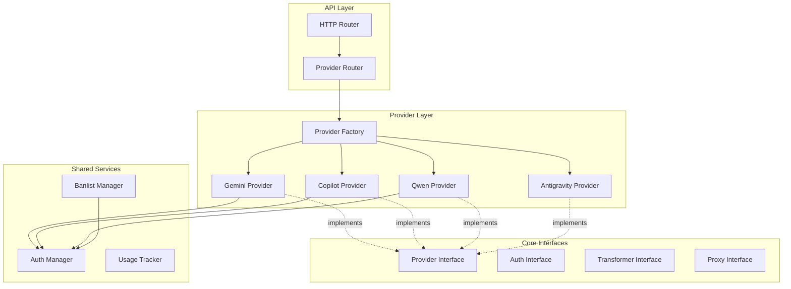

# Multi-Provider Platform Refactoring Plan

## Executive Summary

This document outlines a comprehensive refactoring strategy to transform the current Gemini-cli-only codebase into a scalable, modular multi-provider platform supporting Copilot, Qwen, and Antigravity with extensibility for future providers.

## Architecture Overview

### Design Patterns

We will implement a hybrid approach combining **Strategy Pattern** for provider-specific logic and **Factory Pattern** for provider instantiation:



### Key Principles

1. **Interface-Driven Design**: All providers implement common interfaces
2. **Zero Spaghetti Dependencies**: Clear separation of concerns with dependency injection
3. **Configuration-Driven**: Provider-specific settings externalized
4. **Extensibility**: Adding new providers requires minimal code changes
5. **Code Reuse**: Common functionality abstracted into shared services

## Recommended Directory Structure

```
gcli2apigo/
├── cmd/
│   └── generate-key/
│   └── migrate/
├── internal/
│   ├── app/
│   │   └── app.go                          # Application initialization
│   ├── auth/
│   │   ├── auth.go                         # Generic auth interface
│   │   ├── auth_manager.go                 # Auth manager implementation
│   │   ├── credential_pool.go              # Shared credential pool
│   │   └── providers/                      # Provider-specific auth
│   │       ├── gemini_auth.go
│   │       ├── copilot_auth.go
│   │       ├── qwen_auth.go
│   │       └── antigravity_auth.go
│   ├── config/
│   │   ├── config.go                       # Global config
│   │   ├── provider_config.go              # Provider-specific config
│   │   └── proxy_config.go                # Proxy configuration
│   ├── providers/
│   │   ├── interfaces.go                   # Core provider interfaces
│   │   ├── factory.go                     # Provider factory
│   │   ├── registry.go                    # Provider registry
│   │   ├── gemini/
│   │   │   ├── provider.go                # Gemini provider implementation
│   │   │   ├── client.go                  # Gemini HTTP client
│   │   │   ├── transformer.go             # Request/response transformers
│   │   │   └── models.go                 # Gemini-specific models
│   │   ├── copilot/
│   │   │   ├── provider.go
│   │   │   ├── client.go
│   │   │   ├── transformer.go
│   │   │   └── models.go
│   │   ├── qwen/
│   │   │   ├── provider.go
│   │   │   ├── client.go
│   │   │   ├── transformer.go
│   │   │   └── models.go
│   │   └── antigravity/
│   │       ├── provider.go
│   │       ├── client.go
│   │       ├── transformer.go
│   │       └── models.go
│   ├── routes/
│   │   ├── router.go                      # Main router setup
│   │   ├── middleware.go                  # Shared middleware
│   │   ├── provider_router.go             # Provider-specific routing
│   │   └── handlers/
│   │       ├── health.go
│   │       └── models.go
│   ├── proxy/
│   │   ├── interfaces.go                  # Proxy interfaces
│   │   ├── manager.go                     # Proxy manager
│   │   ├── http_proxy.go                 # HTTP proxy implementation
│   │   └── providers/
│   │       ├── gemini_proxy.go
│   │       ├── copilot_proxy.go
│   │       ├── qwen_proxy.go
│   │       └── antigravity_proxy.go
│   ├── transformers/
│   │   ├── interfaces.go                  # Transformer interfaces
│   │   ├── openai_transformer.go         # OpenAI format transformer
│   │   └── utils.go                     # Shared utilities
│   ├── models/
│   │   ├── common.go                     # Common models
│   │   ├── request.go                    # Request models
│   │   └── response.go                   # Response models
│   ├── client/
│   │   ├── interfaces.go                 # Client interfaces
│   │   ├── http_client.go                # Shared HTTP client
│   │   └── rate_limiter.go              # Rate limiting
│   ├── usage/
│   │   └── usage.go                     # Usage tracking
│   ├── banlist/
│   │   └── banlist.go                    # Banlist management
│   ├── dashboard/
│   │   └── ...                          # Existing dashboard code
│   └── httputil/
│       └── ...                          # Existing HTTP utilities
├── data/
├── docs/
├── oauth_creds/
├── .env.example
├── go.mod
├── go.sum
├── main.go
└── README.md
```

## Core Interface Definitions

### 1. Provider Interface (`internal/providers/interfaces.go`)

```go
package providers

import (
    "context"
    "net/http"
    
    "gcli2apigo/internal/models"
)

// ProviderType identifies the AI provider
type ProviderType string

const (
    ProviderGemini      ProviderType = "gemini"
    ProviderCopilot    ProviderType = "copilot"
    ProviderQwen       ProviderType = "qwen"
    ProviderAntigravity ProviderType = "antigravity"
)

// Provider defines the contract for all AI providers
type Provider interface {
    // Provider identification
    GetType() ProviderType
    GetName() string
    GetVersion() string
    
    // Model management
    ListModels(ctx context.Context) ([]models.ModelInfo, error)
    ValidateModel(modelID string) bool
    
    // Request handling
    HandleChatCompletion(ctx context.Context, req *models.ChatCompletionRequest) (*models.ChatCompletionResponse, error)
    HandleStreamingChatCompletion(ctx context.Context, req *models.ChatCompletionRequest) (<-chan string, error)
    
    // Authentication
    GetAuthenticator() auth.Authenticator
    RequiresAuth() bool
    
    // Configuration
    GetConfig() ProviderConfig
    UpdateConfig(config ProviderConfig) error
    
    // Health check
    HealthCheck(ctx context.Context) error
    
    // Cleanup
    Close() error
}

// ProviderConfig holds provider-specific configuration
type ProviderConfig struct {
    Type        ProviderType            `json:"type"`
    Enabled     bool                   `json:"enabled"`
    APIEndpoint string                 `json:"api_endpoint"`
    Proxy       *ProxyConfig           `json:"proxy,omitempty"`
    Auth        *AuthConfig            `json:"auth,omitempty"`
    RateLimit   *RateLimitConfig       `json:"rate_limit,omitempty"`
    Models      []models.ModelInfo     `json:"models,omitempty"`
    Metadata    map[string]interface{} `json:"metadata,omitempty"`
}

// ProxyConfig defines proxy settings for a provider
type ProxyConfig struct {
    Enabled    bool   `json:"enabled"`
    HTTPProxy  string `json:"http_proxy"`
    HTTPSProxy string `json:"https_proxy"`
    NoProxy    string `json:"no_proxy"`
}

// AuthConfig defines authentication settings
type AuthConfig struct {
    Type           string                 `json:"type"` // oauth, api_key, jwt
    ClientID       string                 `json:"client_id,omitempty"`
    ClientSecret   string                 `json:"client_secret,omitempty"`
    Scopes         []string               `json:"scopes,omitempty"`
    TokenEndpoint  string                 `json:"token_endpoint,omitempty"`
    AuthEndpoint   string                 `json:"auth_endpoint,omitempty"`
    Extra          map[string]interface{} `json:"extra,omitempty"`
}

// RateLimitConfig defines rate limiting settings
type RateLimitConfig struct {
    Enabled      bool `json:"enabled"`
    RequestsPerSecond int `json:"requests_per_second"`
    BurstSize    int  `json:"burst_size"`
}
```

### 2. Transformer Interface (`internal/transformers/interfaces.go`)

```go
package transformers

import (
    "gcli2apigo/internal/models"
)

// Transformer defines the contract for request/response transformation
type Transformer interface {
    // Transform OpenAI request to provider format
    RequestToProvider(req *models.OpenAIChatCompletionRequest) (interface{}, error)
    
    // Transform provider response to OpenAI format
    ResponseToOpenAI(resp interface{}, model string) (*models.OpenAIChatCompletionResponse, error)
    
    // Transform streaming response chunks
    StreamChunkToOpenAI(chunk string) (*models.OpenAIChatCompletionStreamResponse, error)
    
    // Validate request format
    ValidateRequest(req *models.OpenAIChatCompletionRequest) error
    
    // Get supported features
    GetSupportedFeatures() *FeatureSupport
}

// FeatureSupport indicates which features are supported
type FeatureSupport struct {
    Streaming          bool `json:"streaming"`
    Thinking           bool `json:"thinking"`
    Tools             bool `json:"tools"`
    Images            bool `json:"images"`
    JSONMode          bool `json:"json_mode"`
    SystemPrompt      bool `json:"system_prompt"`
    FunctionCalling   bool `json:"function_calling"`
}
```

### 3. Proxy Interface (`internal/proxy/interfaces.go`)

```go
package proxy

import (
    "context"
    "net/http"
    "net/url"
)

// Proxy defines the contract for HTTP proxying
type Proxy interface {
    // Get proxy URL for a given request
    GetProxyURL(req *http.Request) (*url.URL, error)
    
    // Create proxied HTTP client
    GetHTTPClient() (*http.Client, error)
    
    // Wrap request with proxy configuration
    WrapRequest(req *http.Request) (*http.Request, error)
    
    // Validate proxy configuration
    Validate() error
    
    // Health check
    HealthCheck(ctx context.Context) error
}

// ProxyManager manages multiple proxy configurations
type ProxyManager interface {
    // Get proxy for a specific provider
    GetProxy(providerType string) (Proxy, error)
    
    // Register a proxy for a provider
    RegisterProxy(providerType string, proxy Proxy) error
    
    // Remove proxy for a provider
    RemoveProxy(providerType string) error
    
    // Update proxy configuration
    UpdateProxy(providerType string, config ProxyConfig) error
    
    // Get all proxy configurations
    GetAllProxies() map[string]Proxy
}
```

## Provider Factory Implementation

### Factory Pattern (`internal/providers/factory.go`)

```go
package providers

import (
    "errors"
    "fmt"
    
    "gcli2apigo/internal/auth"
    "gcli2apigo/internal/config"
)

// ProviderFactory creates provider instances
type ProviderFactory struct {
    registry map[ProviderType]ProviderCreator
    authMgr  *auth.AuthManager
}

// ProviderCreator is a function that creates a provider instance
type ProviderCreator func(cfg ProviderConfig, authMgr *auth.AuthManager) (Provider, error)

// NewProviderFactory creates a new provider factory
func NewProviderFactory(authMgr *auth.AuthManager) *ProviderFactory {
    factory := &ProviderFactory{
        registry: make(map[ProviderType]ProviderCreator),
        authMgr:  authMgr,
    }
    
    // Register built-in providers
    factory.RegisterProvider(ProviderGemini, NewGeminiProvider)
    factory.RegisterProvider(ProviderCopilot, NewCopilotProvider)
    factory.RegisterProvider(ProviderQwen, NewQwenProvider)
    factory.RegisterProvider(ProviderAntigravity, NewAntigravityProvider)
    
    return factory
}

// RegisterProvider registers a new provider creator
func (f *ProviderFactory) RegisterProvider(pType ProviderType, creator ProviderCreator) {
    f.registry[pType] = creator
}

// CreateProvider creates a provider instance from configuration
func (f *ProviderFactory) CreateProvider(cfg ProviderConfig) (Provider, error) {
    creator, exists := f.registry[cfg.Type]
    if !exists {
        return nil, fmt.Errorf("unsupported provider type: %s", cfg.Type)
    }
    
    return creator(cfg, f.authMgr)
}

// CreateProviderFromEnv creates a provider from environment variables
func (f *ProviderFactory) CreateProviderFromEnv(pType ProviderType) (Provider, error) {
    cfg, err := config.GetProviderConfig(pType)
    if err != nil {
        return nil, err
    }
    
    return f.CreateProvider(cfg)
}

// GetSupportedProviders returns list of supported provider types
func (f *ProviderFactory) GetSupportedProviders() []ProviderType {
    types := make([]ProviderType, 0, len(f.registry))
    for t := range f.registry {
        types = append(types, t)
    }
    return types
}
```

## Routing Mechanism Design

### Provider Router (`internal/routes/provider_router.go`)

```go
package routes

import (
    "net/http"
    "strings"
    
    "gcli2apigo/internal/providers"
)

// ProviderRouter handles routing to different providers
type ProviderRouter struct {
    factory     *providers.ProviderFactory
    providers   map[providers.ProviderType]providers.Provider
    middleware  []Middleware
}

// Middleware is a function that wraps an HTTP handler
type Middleware func(http.Handler) http.Handler

// NewProviderRouter creates a new provider router
func NewProviderRouter(factory *providers.ProviderFactory) *ProviderRouter {
    return &ProviderRouter{
        factory:   factory,
        providers: make(map[providers.ProviderType]providers.Provider),
        middleware: []Middleware{
            corsMiddleware,
            loggingMiddleware,
            authMiddleware,
            rateLimitMiddleware,
        },
    }
}

// RegisterProvider registers a provider with the router
func (r *ProviderRouter) RegisterProvider(p providers.Provider) error {
    r.providers[p.GetType()] = p
    return nil
}

// SetupRoutes configures all provider routes
func (r *ProviderRouter) SetupRoutes(mux *http.ServeMux) {
    // Health check (no auth required)
    mux.HandleFunc("/health", r.handleHealth)
    
    // Provider-specific endpoints
    // Gemini routes
    r.setupProviderRoutes(mux, providers.ProviderGemini, "/geminicli")
    
    // Copilot routes
    r.setupProviderRoutes(mux, providers.ProviderCopilot, "/copilotcli")
    
    // Qwen routes
    r.setupProviderRoutes(mux, providers.ProviderQwen, "/qwencli")
    
    // Antigravity routes
    r.setupProviderRoutes(mux, providers.ProviderAntigravity, "/antigravitycli")
    
    // OpenAI-compatible routes (default provider)
    mux.HandleFunc("/v1/chat/completions", r.handleDefaultChatCompletions)
    mux.HandleFunc("/v1/models", r.handleDefaultListModels)
}

// setupProviderRoutes sets up routes for a specific provider
func (r *ProviderRouter) setupProviderRoutes(mux *http.ServeMux, pType providers.ProviderType, basePath string) {
    // Apply middleware chain
    handler := r.applyMiddleware(http.HandlerFunc(func(w http.ResponseWriter, req *http.Request) {
        r.handleProviderRequest(w, req, pType)
    }))
    
    // Register routes
    mux.HandleFunc(basePath+"/chat/completions", handler.ServeHTTP)
    mux.HandleFunc(basePath+"/models", handler.ServeHTTP)
    mux.HandleFunc(basePath+"/", handler.ServeHTTP)
}

// handleProviderRequest routes requests to the appropriate provider
func (r *ProviderRouter) handleProviderRequest(w http.ResponseWriter, req *http.Request, pType providers.ProviderType) {
    provider, exists := r.providers[pType]
    if !exists {
        http.Error(w, `{"error":{"message":"Provider not configured","code":404}}`, http.StatusNotFound)
        return
    }
    
    if !provider.GetConfig().Enabled {
        http.Error(w, `{"error":{"message":"Provider disabled","code":503}}`, http.StatusServiceUnavailable)
        return
    }
    
    // Route based on request path
    path := strings.TrimPrefix(req.URL.Path, "/"+string(pType))
    
    switch {
    case path == "/chat/completions":
        r.handleChatCompletions(w, req, provider)
    case path == "/models":
        r.handleListModels(w, req, provider)
    default:
        r.handleProxy(w, req, provider)
    }
}

// applyMiddleware applies middleware chain to a handler
func (r *ProviderRouter) applyMiddleware(handler http.Handler) http.Handler {
    for i := len(r.middleware) - 1; i >= 0; i-- {
        handler = r.middleware[i](handler)
    }
    return handler
}
```

### Shared Middleware (`internal/routes/middleware.go`)

```go
package routes

import (
    "log"
    "net/http"
    "time"
    
    "gcli2apigo/internal/auth"
)

// corsMiddleware adds CORS headers
func corsMiddleware(next http.Handler) http.Handler {
    return http.HandlerFunc(func(w http.ResponseWriter, r *http.Request) {
        w.Header().Set("Access-Control-Allow-Origin", "*")
        w.Header().Set("Access-Control-Allow-Methods", "GET, POST, PUT, DELETE, PATCH, OPTIONS")
        w.Header().Set("Access-Control-Allow-Headers", "*")
        w.Header().Set("Access-Control-Allow-Credentials", "true")
        
        if r.Method == http.MethodOptions {
            w.WriteHeader(http.StatusOK)
            return
        }
        
        next.ServeHTTP(w, r)
    })
}

// loggingMiddleware logs HTTP requests
func loggingMiddleware(next http.Handler) http.Handler {
    return http.HandlerFunc(func(w http.ResponseWriter, r *http.Request) {
        start := time.Now()
        
        // Wrap response writer to capture status code
        wrapped := &responseWriter{ResponseWriter: w}
        
        next.ServeHTTP(wrapped, r)
        
        duration := time.Since(start)
        log.Printf("%s %s %d %v", r.Method, r.URL.Path, wrapped.status, duration)
    })
}

// authMiddleware validates authentication
func authMiddleware(next http.Handler) http.Handler {
    return http.HandlerFunc(func(w http.ResponseWriter, r *http.Request) {
        // Skip auth for health check
        if r.URL.Path == "/health" {
            next.ServeHTTP(w, r)
            return
        }
        
        // Validate authentication
        if _, err := auth.AuthenticateUser(r); err != nil {
            http.Error(w, `{"error":{"message":"Invalid authentication credentials","code":401}}`, http.StatusUnauthorized)
            return
        }
        
        next.ServeHTTP(w, r)
    })
}

// rateLimitMiddleware applies rate limiting
func rateLimitMiddleware(next http.Handler) http.Handler {
    return http.HandlerFunc(func(w http.ResponseWriter, r *http.Request) {
        // Implement rate limiting logic here
        // This can use the existing rate limiting infrastructure
        next.ServeHTTP(w, r)
    })
}

// responseWriter wraps http.ResponseWriter to capture status code
type responseWriter struct {
    http.ResponseWriter
    status int
}

func (rw *responseWriter) WriteHeader(code int) {
    rw.status = code
    rw.ResponseWriter.WriteHeader(code)
}
```

## Proxy Configuration Strategy

### Proxy Manager (`internal/proxy/manager.go`)

```go
package proxy

import (
    "context"
    "errors"
    "fmt"
    "net/http"
    "net/url"
    "sync"
    
    "gcli2apigo/internal/config"
)

// ProxyManagerImpl implements ProxyManager
type ProxyManagerImpl struct {
    mu     sync.RWMutex
    proxies map[string]Proxy
}

// NewProxyManager creates a new proxy manager
func NewProxyManager() *ProxyManagerImpl {
    return &ProxyManagerImpl{
        proxies: make(map[string]Proxy),
    }
}

// InitializeFromConfig initializes proxies from configuration
func (pm *ProxyManagerImpl) InitializeFromConfig() error {
    // Load proxy configurations for each provider
    providers := []string{"gemini", "copilot", "qwen", "antigravity"}
    
    for _, provider := range providers {
        cfg, err := config.GetProxyConfig(provider)
        if err != nil {
            continue // Skip if no config
        }
        
        if cfg.Enabled {
            proxy, err := NewHTTPProxy(cfg)
            if err != nil {
                return fmt.Errorf("failed to create proxy for %s: %w", provider, err)
            }
            
            if err := pm.RegisterProxy(provider, proxy); err != nil {
                return fmt.Errorf("failed to register proxy for %s: %w", provider, err)
            }
        }
    }
    
    return nil
}

// GetProxy returns the proxy for a specific provider
func (pm *ProxyManagerImpl) GetProxy(providerType string) (Proxy, error) {
    pm.mu.RLock()
    defer pm.mu.RUnlock()
    
    proxy, exists := pm.proxies[providerType]
    if !exists {
        return nil, fmt.Errorf("no proxy configured for provider: %s", providerType)
    }
    
    return proxy, nil
}

// RegisterProxy registers a proxy for a provider
func (pm *ProxyManagerImpl) RegisterProxy(providerType string, proxy Proxy) error {
    if proxy == nil {
        return errors.New("proxy cannot be nil")
    }
    
    // Validate proxy configuration
    if err := proxy.Validate(); err != nil {
        return fmt.Errorf("invalid proxy configuration: %w", err)
    }
    
    pm.mu.Lock()
    defer pm.mu.Unlock()
    
    pm.proxies[providerType] = proxy
    return nil
}

// RemoveProxy removes a proxy for a provider
func (pm *ProxyManagerImpl) RemoveProxy(providerType string) error {
    pm.mu.Lock()
    defer pm.mu.Unlock()
    
    if _, exists := pm.proxies[providerType]; !exists {
        return fmt.Errorf("no proxy configured for provider: %s", providerType)
    }
    
    delete(pm.proxies, providerType)
    return nil
}

// UpdateProxy updates proxy configuration for a provider
func (pm *ProxyManagerImpl) UpdateProxy(providerType string, cfg ProxyConfig) error {
    proxy, err := NewHTTPProxy(cfg)
    if err != nil {
        return err
    }
    
    return pm.RegisterProxy(providerType, proxy)
}

// GetAllProxies returns all registered proxies
func (pm *ProxyManagerImpl) GetAllProxies() map[string]Proxy {
    pm.mu.RLock()
    defer pm.mu.RUnlock()
    
    result := make(map[string]Proxy, len(pm.proxies))
    for k, v := range pm.proxies {
        result[k] = v
    }
    
    return result
}
```

### HTTP Proxy Implementation (`internal/proxy/http_proxy.go`)

```go
package proxy

import (
    "context"
    "fmt"
    "net/http"
    "net/url"
    "strings"
    "time"
)

// HTTPProxy implements Proxy for HTTP/HTTPS proxying
type HTTPProxy struct {
    config ProxyConfig
    client *http.Client
}

// NewHTTPProxy creates a new HTTP proxy
func NewHTTPProxy(cfg ProxyConfig) (*HTTPProxy, error) {
    proxy := &HTTPProxy{
        config: cfg,
    }
    
    // Create HTTP client with proxy configuration
    client, err := proxy.createHTTPClient()
    if err != nil {
        return nil, err
    }
    
    proxy.client = client
    return proxy, nil
}

// createHTTPClient creates an HTTP client configured with proxy
func (p *HTTPProxy) createHTTPClient() (*http.Client, error) {
    var proxyURL *url.URL
    var err error
    
    // Determine which proxy to use based on scheme
    if p.config.HTTPSProxy != "" {
        proxyURL, err = url.Parse(p.config.HTTPSProxy)
    } else if p.config.HTTPProxy != "" {
        proxyURL, err = url.Parse(p.config.HTTPProxy)
    }
    
    if err != nil {
        return nil, fmt.Errorf("invalid proxy URL: %w", err)
    }
    
    transport := &http.Transport{
        Proxy: http.ProxyURL(proxyURL),
        // Configure timeout and connection pooling
        DialContext: (&net.Dialer{
            Timeout:   30 * time.Second,
            KeepAlive: 30 * time.Second,
        }).DialContext,
        MaxIdleConns:          100,
        IdleConnTimeout:       90 * time.Second,
        TLSHandshakeTimeout:   10 * time.Second,
        ExpectContinueTimeout:  1 * time.Second,
    }
    
    return &http.Client{
        Transport: transport,
        Timeout:   5 * time.Minute,
    }, nil
}

// GetProxyURL returns the proxy URL for a request
func (p *HTTPProxy) GetProxyURL(req *http.Request) (*url.URL, error) {
    if !p.config.Enabled {
        return nil, nil
    }
    
    // Check if request should bypass proxy
    if p.config.NoProxy != "" {
        host := req.URL.Hostname()
        for _, bypass := range strings.Split(p.config.NoProxy, ",") {
            if strings.TrimSpace(bypass) == host {
                return nil, nil
            }
        }
    }
    
    // Select appropriate proxy based on scheme
    proxyStr := p.config.HTTPSProxy
    if req.URL.Scheme == "http" {
        proxyStr = p.config.HTTPProxy
    }
    
    if proxyStr == "" {
        return nil, nil
    }
    
    return url.Parse(proxyStr)
}

// GetHTTPClient returns the configured HTTP client
func (p *HTTPProxy) GetHTTPClient() (*http.Client, error) {
    return p.client, nil
}

// WrapRequest wraps a request with proxy configuration
func (p *HTTPProxy) WrapRequest(req *http.Request) (*http.Request, error) {
    // The HTTP client's transport handles proxying
    // This method can be used for any request-specific modifications
    return req, nil
}

// Validate validates the proxy configuration
func (p *HTTPProxy) Validate() error {
    if !p.config.Enabled {
        return nil
    }
    
    if p.config.HTTPProxy == "" && p.config.HTTPSProxy == "" {
        return fmt.Errorf("proxy enabled but no proxy URL configured")
    }
    
    // Validate HTTP proxy URL
    if p.config.HTTPProxy != "" {
        if _, err := url.Parse(p.config.HTTPProxy); err != nil {
            return fmt.Errorf("invalid HTTP proxy URL: %w", err)
        }
    }
    
    // Validate HTTPS proxy URL
    if p.config.HTTPSProxy != "" {
        if _, err := url.Parse(p.config.HTTPSProxy); err != nil {
            return fmt.Errorf("invalid HTTPS proxy URL: %w", err)
        }
    }
    
    return nil
}

// HealthCheck performs a health check on the proxy
func (p *HTTPProxy) HealthCheck(ctx context.Context) error {
    if !p.config.Enabled {
        return nil
    }
    
    // Simple health check by making a request through the proxy
    req, err := http.NewRequestWithContext(ctx, "GET", "https://www.google.com", nil)
    if err != nil {
        return err
    }
    
    _, err = p.client.Do(req)
    return err
}
```

## Configuration Management

### Provider Configuration (`internal/config/provider_config.go`)

```go
package config

import (
    "os"
    "strconv"
)

// GetProviderConfig returns configuration for a specific provider
func GetProviderConfig(providerType string) (ProviderConfig, error) {
    prefix := strings.ToUpper(providerType)
    
    cfg := ProviderConfig{
        Type:    ProviderType(providerType),
        Enabled: getEnvBool(prefix + "_ENABLED", false),
        Proxy: &ProxyConfig{
            Enabled:    getEnvBool(prefix+"_PROXY_ENABLED", false),
            HTTPProxy:  getEnv(prefix + "_PROXY_HTTP"),
            HTTPSProxy: getEnv(prefix + "_PROXY_HTTPS"),
            NoProxy:    getEnv(prefix + "_PROXY_NO"),
        },
        Auth: &AuthConfig{
            Type:          getEnv(prefix + "_AUTH_TYPE", "oauth"),
            ClientID:      getEnv(prefix + "_CLIENT_ID"),
            ClientSecret:  getEnv(prefix + "_CLIENT_SECRET"),
            TokenEndpoint: getEnv(prefix + "_TOKEN_ENDPOINT"),
            AuthEndpoint:  getEnv(prefix + "_AUTH_ENDPOINT"),
        },
        RateLimit: &RateLimitConfig{
            Enabled:           getEnvBool(prefix+"_RATE_LIMIT_ENABLED", true),
            RequestsPerSecond: getEnvInt(prefix+"_RATE_LIMIT_RPS", 8),
            BurstSize:         getEnvInt(prefix+"_RATE_LIMIT_BURST", 10),
        },
    }
    
    // Set API endpoint based on provider
    cfg.APIEndpoint = getEnv(prefix+"_API_ENDPOINT", getDefaultAPIEndpoint(providerType))
    
    return cfg, nil
}

// GetProxyConfig returns proxy configuration for a provider
func GetProxyConfig(providerType string) (*ProxyConfig, error) {
    cfg, err := GetProviderConfig(providerType)
    if err != nil {
        return nil, err
    }
    return cfg.Proxy, nil
}

// getDefaultAPIEndpoint returns the default API endpoint for a provider
func getDefaultAPIEndpoint(providerType string) string {
    switch providerType {
    case "gemini":
        return "https://cloudcode-pa.googleapis.com"
    case "copilot":
        return "https://api.githubcopilot.com"
    case "qwen":
        return "https://dashscope.aliyuncs.com"
    case "antigravity":
        return "https://api.antigravity.com"
    default:
        return ""
    }
}

func getEnv(key, defaultValue string) string {
    if value := os.Getenv(key); value != "" {
        return value
    }
    return defaultValue
}

func getEnvBool(key string, defaultValue bool) bool {
    if value := os.Getenv(key); value != "" {
        if parsed, err := strconv.ParseBool(value); err == nil {
            return parsed
        }
    }
    return defaultValue
}

func getEnvInt(key string, defaultValue int) int {
    if value := os.Getenv(key); value != "" {
        if parsed, err := strconv.Atoi(value); err == nil {
            return parsed
        }
    }
    return defaultValue
}
```

## Step-by-Step Refactoring Plan

### Phase 1: Foundation (Week 1-2)

**Goal**: Establish core interfaces and infrastructure

1. **Create Interface Definitions**
   - Create `internal/providers/interfaces.go` with Provider interface
   - Create `internal/transformers/interfaces.go` with Transformer interface
   - Create `internal/proxy/interfaces.go` with Proxy interface
   - Create `internal/models/common.go` with shared models

2. **Implement Proxy Infrastructure**
   - Create `internal/proxy/manager.go` - ProxyManager implementation
   - Create `internal/proxy/http_proxy.go` - HTTP proxy implementation
   - Create `internal/config/proxy_config.go` - Proxy configuration

3. **Refactor Configuration**
   - Create `internal/config/provider_config.go` - Provider-specific config
   - Update `.env.example` with provider-specific variables
   - Add proxy configuration variables for each provider

4. **Create Factory Pattern**
   - Create `internal/providers/factory.go` - Provider factory
   - Create `internal/providers/registry.go` - Provider registry

### Phase 2: Provider Abstraction (Week 3-4)

**Goal**: Abstract existing Gemini provider

1. **Refactor Gemini Provider**
   - Create `internal/providers/gemini/` directory
   - Move existing Gemini logic into `provider.go`
   - Create `internal/providers/gemini/client.go` - Extract client code
   - Create `internal/providers/gemini/transformer.go` - Extract transformer code
   - Create `internal/providers/gemini/models.go` - Provider-specific models

2. **Implement Gemini Provider Interface**
   - Make Gemini provider implement Provider interface
   - Implement all required methods
   - Ensure backward compatibility

3. **Refactor Authentication**
   - Create `internal/auth/interfaces.go` - Authenticator interface
   - Create `internal/auth/auth_manager.go` - Auth manager
   - Create `internal/auth/providers/gemini_auth.go` - Gemini auth
   - Refactor existing auth code to use new structure

4. **Update Routes**
   - Create `internal/routes/provider_router.go` - Provider router
   - Create `internal/routes/middleware.go` - Shared middleware
   - Update `main.go` to use new routing

### Phase 3: New Providers (Week 5-7)

**Goal**: Implement Copilot, Qwen, and Antigravity providers

1. **Implement Copilot Provider**
   - Create `internal/providers/copilot/` directory
   - Implement `provider.go` - Copilot provider
   - Implement `client.go` - Copilot HTTP client
   - Implement `transformer.go` - Request/response transformers
   - Implement `models.go` - Copilot-specific models
   - Create `internal/auth/providers/copilot_auth.go` - Copilot auth

2. **Implement Qwen Provider**
   - Create `internal/providers/qwen/` directory
   - Implement `provider.go` - Qwen provider
   - Implement `client.go` - Qwen HTTP client
   - Implement `transformer.go` - Request/response transformers
   - Implement `models.go` - Qwen-specific models
   - Create `internal/auth/providers/qwen_auth.go` - Qwen auth

3. **Implement Antigravity Provider**
   - Create `internal/providers/antigravity/` directory
   - Implement `provider.go` - Antigravity provider
   - Implement `client.go` - Antigravity HTTP client
   - Implement `transformer.go` - Request/response transformers
   - Implement `models.go` - Antigravity-specific models
   - Create `internal/auth/providers/antigravity_auth.go` - Antigravity auth

### Phase 4: Integration & Testing (Week 8)

**Goal**: Integrate all providers and ensure functionality

1. **Register All Providers**
   - Update factory to register all providers
   - Update provider router to handle all providers
   - Update configuration loading

2. **Implement Provider-Specific Routes**
   - Add `/geminicli` routes
   - Add `/copilotcli` routes
   - Add `/qwencli` routes
   - Add `/antigravitycli` routes

3. **Configure Proxies**
   - Set up proxy configurations for each provider
   - Implement proxy validation
   - Add proxy health checks

4. **Testing**
   - Unit tests for each provider
   - Integration tests for routing
   - End-to-end tests for proxy functionality
   - Performance testing

### Phase 5: Documentation & Cleanup (Week 9)

**Goal**: Complete documentation and code cleanup

1. **Documentation**
   - Update README with multi-provider support
   - Create provider-specific documentation
   - Document environment variables
   - Create architecture diagrams

2. **Code Cleanup**
   - Remove deprecated code
   - Update comments and documentation
   - Ensure consistent code style
   - Optimize performance

3. **Final Testing**
   - Load testing
   - Security testing
   - Compatibility testing

## Environment Variables

### Example `.env` Configuration

```bash
# Server Configuration
HOST=0.0.0.0
PORT=7860
PASSWORD=your_secure_password

# Gemini Provider
GEMINI_ENABLED=true
GEMINI_API_ENDPOINT=https://cloudcode-pa.googleapis.com
GEMINI_PROXY_ENABLED=true
GEMINI_PROXY_HTTP=http://proxy.example.com:8080
GEMINI_PROXY_HTTPS=http://proxy.example.com:8080
GEMINI_PROXY_NO=localhost,127.0.0.1
GEMINI_AUTH_TYPE=oauth
GEMINI_CLIENT_ID=681255809395-oo8ft2oprdrnp9e3aqf6av3hmdib135j.apps.googleusercontent.com
GEMINI_CLIENT_SECRET=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
GEMINI_TOKEN_ENDPOINT=https://oauth2.googleapis.com/token
GEMINI_AUTH_ENDPOINT=https://accounts.google.com/o/oauth2/v2/auth
GEMINI_RATE_LIMIT_ENABLED=true
GEMINI_RATE_LIMIT_RPS=8
GEMINI_RATE_LIMIT_BURST=10

# Copilot Provider
COPILOT_ENABLED=true
COPILOT_API_ENDPOINT=https://api.githubcopilot.com
COPILOT_PROXY_ENABLED=true
COPILOT_PROXY_HTTP=http://copilot-proxy.example.com:8080
COPILOT_PROXY_HTTPS=http://copilot-proxy.example.com:8080
COPILOT_AUTH_TYPE=oauth
COPILOT_CLIENT_ID=your_copilot_client_id
COPILOT_CLIENT_SECRET=your_copilot_client_secret
COPILOT_TOKEN_ENDPOINT=https://github.com/login/oauth/access_token
COPILOT_AUTH_ENDPOINT=https://github.com/login/oauth/authorize
COPILOT_RATE_LIMIT_ENABLED=true
COPILOT_RATE_LIMIT_RPS=10
COPILOT_RATE_LIMIT_BURST=15

# Qwen Provider
QWEN_ENABLED=true
QWEN_API_ENDPOINT=https://dashscope.aliyuncs.com
QWEN_PROXY_ENABLED=true
QWEN_PROXY_HTTP=http://qwen-proxy.example.com:8080
QWEN_PROXY_HTTPS=http://qwen-proxy.example.com:8080
QWEN_AUTH_TYPE=api_key
QWEN_API_KEY=your_qwen_api_key
QWEN_RATE_LIMIT_ENABLED=true
QWEN_RATE_LIMIT_RPS=20
QWEN_RATE_LIMIT_BURST=30

# Antigravity Provider
ANTIGRAVITY_ENABLED=true
ANTIGRAVITY_API_ENDPOINT=https://api.antigravity.com
ANTIGRAVITY_PROXY_ENABLED=true
ANTIGRAVITY_PROXY_HTTP=http://antigravity-proxy.example.com:8080
ANTIGRAVITY_PROXY_HTTPS=http://antigravity-proxy.example.com:8080
ANTIGRAVITY_AUTH_TYPE=jwt
ANTIGRAVITY_JWT_SECRET=your_jwt_secret
ANTIGRAVITY_RATE_LIMIT_ENABLED=true
ANTIGRAVITY_RATE_LIMIT_RPS=15
ANTIGRAVITY_RATE_LIMIT_BURST=20

# Debugging
DEBUG_LOGGING=false
DEFAULT_LANGUAGE=en
MAX_RETRY_ATTEMPTS=5
```

## Migration Strategy

### Backward Compatibility

1. **Maintain Existing Endpoints**
   - Keep `/v1/chat/completions` working (routes to default provider)
   - Keep `/v1/models` working (routes to default provider)
   - Keep existing Gemini routes for compatibility

2. **Gradual Migration**
   - Phase 1: Introduce new architecture alongside existing code
   - Phase 2: Migrate Gemini provider to new architecture
   - Phase 3: Add new providers
   - Phase 4: Deprecate old routes (with warnings)
   - Phase 5: Remove old code

3. **Feature Flags**
   - Use environment variables to enable/disable new architecture
   - Allow gradual rollout of new features
   - Provide rollback capability

## Testing Strategy

### Unit Tests

- Provider interface implementations
- Transformer logic
- Proxy configuration
- Authentication flows
- Rate limiting

### Integration Tests

- Provider factory
- Provider router
- Proxy manager
- End-to-end request flows

### Performance Tests

- Concurrent request handling
- Proxy performance
- Rate limiting effectiveness
- Memory usage

## Security Considerations

1. **Credential Management**
   - Separate credential storage per provider
   - Secure credential rotation
   - Encrypted credential storage

2. **Proxy Security**
   - Validate proxy URLs
   - Prevent proxy bypass
   - Monitor proxy usage

3. **Rate Limiting**
   - Per-provider rate limits
   - Global rate limits
   - DDoS protection

4. **Authentication**
   - Provider-specific authentication
   - Token refresh handling
   - Session management

## Monitoring & Observability

1. **Metrics**
   - Request counts per provider
   - Error rates per provider
   - Response times
   - Proxy health

2. **Logging**
   - Structured logging
   - Request/response logging (debug mode)
   - Error tracking

3. **Health Checks**
   - Provider health
   - Proxy health
   - Overall system health

## Conclusion

This refactoring plan provides a comprehensive roadmap for transforming the current single-provider codebase into a scalable, modular multi-provider platform. The architecture ensures:

- **Clean separation of concerns** through interfaces
- **Code reuse** through shared services
- **Extensibility** for future providers
- **Maintainability** through clear structure
- **Scalability** through modular design

The implementation follows industry best practices and design patterns, ensuring a robust and maintainable codebase.
